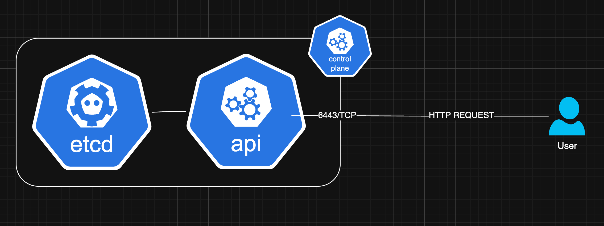

Neste artigo, vou exemplificar as formas de comunicação e administração de um cluster kubernetes sem entrar no mérito da administração em si. O foco inicial é a comunicação do cli com o kube-apiserver, e com isso destrinchar requisitos e formas de acesso ao cluster.

## O que é o kube-apiserver

O kube-apiserver é o componente do Control Plane por onde passa toda a comunicação entre os componentes do Kubernetes. Por hora não entrarei em quais são estes componentes, mas posso dizer que tanto componentes internos do kubernetes (etcd, scheduler, controller...), como componentes de usuário (CLI), tudo passa pelo kube-apiserver. No diagrama acima, estou especificando apenas a comunicação do usuário com o API Server. O etcd é um banco de dados chave-valor responsável por persistir os dados enviados pelo API Server. Só o API Server se comunica com o etcd. 
Caso um usuário precise administrar o kubernetes estará comunicando ao API Server através da porta 6443/tcp. 
Todas as requisições ao API Server passarão por validação de credenciais e autorização. 

## Para que serve o kubectl?
kubectl é a principal ferramenta CLI de administração do kubernetes. Ele é feito em GO e está disponível para a maioria dos SO (Windows, Linux e Mac) e arquiteturas.
Para maiores informações e download, basta entrar no link abaixo.
https://kubernetes.io/docs/tasks/tools/#kubectl

## Utilizando curl para gerenciar kube-apiserver

## Porque precisamos do kubectl, por que ele é melhor?

## Destrinchando arquivo kube config
   ### Contexto, usuário, certificado

## Autenticando com kube-apiserver (sem config)

## Como pegar informaçoes do kubeconfig no cluster

## Autenticando com kube-apiserver agora com o devido kubeconfig
   ### k get nodes, pods, namespaces...

## E se tivermos mais de um cluster/contexto?
   ### Adicionando novos contextos ao kubeconfig
   ### Contexto default
   ### kubectl change context
   ####  k get nodes, pods, namespaces....

## Finalizando kubectl
  ###  Alias e autocomplete

## Gerenciamento mais fácil:   
### k9s
### k9s --context